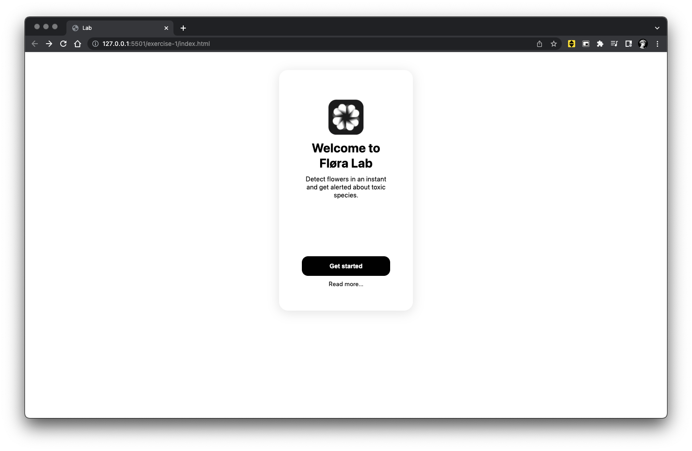

# Bits & Atoms
Bits & Atoms is an Interaction Design BA module series covering creative coding, web development and physical computing during the first four semesters in preparation for related modules.

## Table of Contents
- [Spring Semester 2022](#spring-semester-2022)
  - [Homework 1](#homework-1)

## Spring Semester 2022
### [Homework 1](spring-semester-2022/exercise-1)

